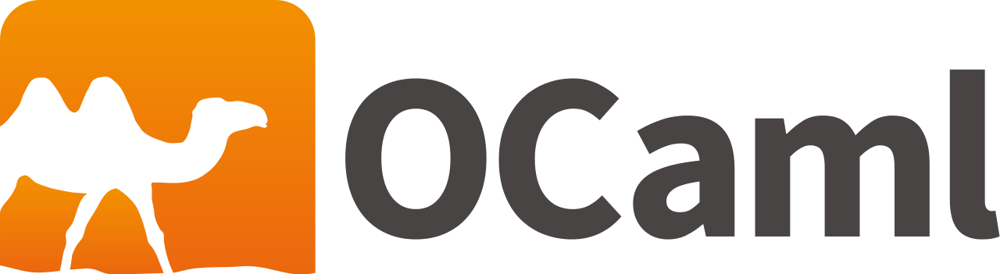

# Paradigmas_de-_Programacion

Programming Pradigms is a second-year subject that focuses on functional programming using Ocaml.

If you are interested in looking for theoretical information about this language, the following manuals could be useful for you.

Manuals

  
- [Ocaml Manual](https://v2.ocaml.org/manual/objectexamples.html)
- [Data Structures and Functional Programming](https://cs3110.github.io/textbook/cover.html)
- [Objects in Ocaml](https://ocaml.org/docs/objects)
- [More Object info](https://dev.realworldocaml.org/objects.html)

In the following folders you will find the practices related to the subject:

  
Practices

  - [P1](https://github.com/Pereirooo/Paradigmas_de_Programacion/tree/main/P1)
  - [P2](https://github.com/Pereirooo/Paradigmas_de_Programacion/tree/main/P2)
  - [P3](https://github.com/Pereirooo/Paradigmas_de_Programacion/tree/main/P3)
  - [P4](https://github.com/Pereirooo/Paradigmas_de_Programacion/tree/main/P4)
  - [P5](https://github.com/Pereirooo/Paradigmas_de_Programacion/tree/main/P5)
  - [P6](https://github.com/Pereirooo/Paradigmas_de_Programacion/tree/main/P6)
  - [P7](https://github.com/Pereirooo/Paradigmas_de_Programacion/tree/main/P7)
  - [P8](https://github.com/Pereirooo/Paradigmas_de_Programacion/tree/main/P8)
  - [P9](https://github.com/Pereirooo/Paradigmas_de_Programacion/tree/main/P9)
  - [P11](https://github.com/Pereirooo/Paradigmas_de_Programacion/tree/main/P11)

